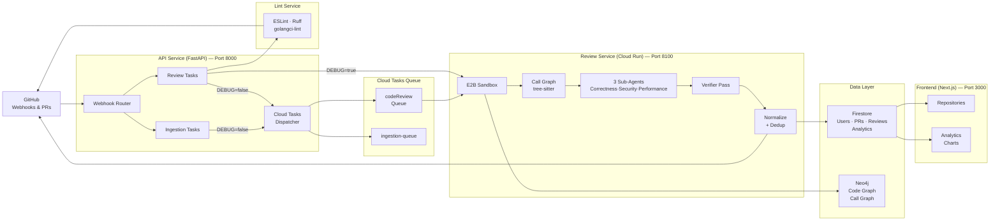

# BugViper

AI PR Reviews with codebase-aware DeepAgents + ESLint, Ruff, golangci-lint and more. Install the GitHub App, open a PR, and BugViper clones the repo, builds a blast radius and call graph on the fly in an E2B sandbox, then posts a full review — inline comments, issue tracking, and a summary — with no friction.

---

## Features

| | |
|---|---|
| 🤖 **AI DeepAgents** | Codebase-aware agents that understand cross-file function interactions, not just isolated snippets |
| 🫡 **Normal Mode** | Single generalist agent — fast, efficient reviews for everyday PRs |
| 🔬 **Deep Mode** | Three specialized sub-agents (correctness, security, performance) run in parallel for thorough analysis |
| 🏝️ **E2B Sandboxes** | Secure isolated sandboxes to clone and review code — no access to your environment |
| 🔍 **Blast Radius + Call Graph** | Builds call graph on the fly so agents see the real impact of every change |
| 🔧 **Third Party Static Analysis** | ESLint, Ruff, golangci-lint — fast lint-only mode with support for Python, JS/TS, Go, and more |
| ✅ **Verifier Pass** | Validates every finding against the actual diff — negates false positives and marks issues as: `nitpick` (low confidence), `valid` (high confidence), or `outside_diff` (not in the PR) |
| 🔀 **Dedup** | Deduplicates findings across batches and agents — same issue reported twice gets merged once |
| 🧠 **Any LLM Model** | Use any model — open source or closed source — via OpenRouter, Gemini, or MiniMax |
| 💬 **Inline Comments** | Posts high-confidence issues directly on the relevant lines in the PR |
| 📊 **Analytics Dashboard** | Tracks bugs caught, resolved, merge times, and PRs reviewed per day |
| 🔁 **Resolve Detection** | Tracks whether previously reported issues were fixed in subsequent PRs — automatically marks issues as `fixed` when the same issue no longer appears |
| 📈 **Per-Repo Analytics** | Stacked bar charts per repo for reviews per day, PRs reviewed, avg merge time, and addressed rate |
| 🐛 **Issue Lifecycle** | Full issue tracking — open, resolved, fixed — with per-issue GitHub comment linkage |
| ☁️ **Cloud Run + Cloud Tasks** | Production-ready deploy on GCP with async task dispatch |

---

## Coming Soon

| | |
|---|---|
| 🧠 **Global Knowledgebase** | Agents learn from review feedback across all repos — common issues and patterns get smarter over time |
| 🌍 **Repo Knowledgebase** | Per-repo memory so agents remember past issues and don't re-report the same things |
| 🛠️ **More Static Analysis** | Adding more third-party tools: Hadolint, ShellCheck, Terraform (HCL), and more |

---

## Architecture

### Service Overview

| Service | Port | Role |
|---------|------|------|
| **API** | 8000 | Receives GitHub webhooks, dispatches review & ingestion tasks, serves REST endpoints |
| **Review** | 8100 | Executes the AI review pipeline — clones repo, builds call graph, runs agents, posts comments |
| **Frontend** | 3000 | Next.js dashboard — analytics charts, repo management, tools config |

---

## Full Review

> Comment `@bugviper full review` on any PR and get a complete AI-powered code review — inline comments, issue tracking, and a summary posted back to GitHub.

### How it works

1. **Trigger** — User comments `@bugviper full review` on a GitHub PR
2. **Clone + Blast Radius** — BugViper clones the repo at the PR head SHA into an E2B sandbox and generates a full call graph via tree-sitter to understand which files call which functions
3. **Scoring + Batching** — Every changed file is scored for its blast radius (how many downstream callers it affects). Files are then grouped into small batches using Louvain community detection so that tightly-connected files are reviewed together
4. **Agent Review** — In **Normal mode**, batches of 4 run sequentially through a single generalist agent. In **Deep mode**, batches of 2 run through 3 specialized sub-agents in parallel (Bug, Security, Performance), each in their own isolated E2B container
5. **Verifier Pass** — Every finding from the agents is validated against the actual diff by a verifier agent. It removes false positives and classifies each issue as `valid`, `nitpick` (low confidence), or `outside_diff`
6. **Dedup + Normalize** — Duplicate findings across batches and agents are merged into a single entry
7. **Post to GitHub** — High-confidence `valid` issues are posted as inline comments on the relevant lines; the full summary is posted as a PR review body

> **Real-world example:** A large PR with **58 files** was reviewed by splitting it into batches based on connected blast-radius components. In Deep mode, 3 agents (Bug, Security, Performance) ran in parallel across 2 batches at a time inside isolated E2B containers, with the verifier removing false positives before any comments were posted.

---

## Run Lint

> Comment `@bugviper run lint` on any PR for a fast static-analysis review using ESLint, Ruff, golangci-lint, and more — results posted back to GitHub in seconds.

### How it works

1. **Trigger** — User comments `@bugviper lint` on a GitHub PR
2. **Queue** — The request is dispatched to the review service via Cloud Tasks (or direct HTTP in local dev with `DEBUG=true`)
3. **Lint Execution** — The configured linters (ESLint, Ruff, golangci-lint) run against the changed files in an isolated E2B sandbox
4. **Parse + Filter** — Lint results are parsed and filtered to only issues that fall within the actual PR diff
5. **Post to GitHub** — Findings are posted as inline comments on the relevant lines, with a summary comment on the PR

> **Note:** Run Lint is designed for speed — no call graph, no AI agents, no batching. It's the fastest way to catch style violations, unused imports, and standard lint errors before merging.

---

## Analytics

> Track your team's code review activity across all repos — bugs caught, resolved, merge times, and PRs reviewed per day.

### What it shows

The analytics dashboard aggregates data from all repos into a single view:

- **Stat Cards** — At a glance: total repos, PRs reviewed, reviews run, bugs caught, addressed rate, PRs per week, and average merge time
- **Total Reviews per Day** — Stacked bar chart with each repo as a colored segment, so you can see which repo generated the most review activity on any given day
- **PRs Reviewed per Day** — Stacked bar chart showing how many unique PRs were reviewed per day, broken down by repo
- **Repository Comparison** — Side-by-side bar charts comparing average merge time and addressed rate across all your repos
- **Per-Repo Detail** — Click into any repo to see its full analytics: daily bug trends, issue lifecycle, and individual PR history with full review run details

Every chart is interactive — hover for breakdowns and click to drill down.

---

## View and Manage Reviews

> Browse all your repos, inspect individual PR reviews, and track what issues the agents found — right from the dashboard.

### How it works

1. **Repos list** — The Repositories page shows every repo you've connected, with stats per repo: open issues, review count, fix rate percentage, and language badge
2. **Repo detail sheet** — Click any repo to open a side panel with:
   - **Stats bar** — total issues raised, resolved, PR count, fix rate, addressed rate, avg merge time, PRs per week, total reviews
   - **PR list** — every reviewed PR with merge status, review count, open issues, and last review timestamp
3. **PR drill-down** — Click a PR to expand its runs. Each run shows review type, duration, issue count, and a "View Details" button
4. **Run detail view** — Opens a full breakdown of a single review run:
   - **Walkthrough** — which files were modified
   - **Issues** — each issue shows: severity (color-coded), category badge, issue type, confidence score, file location, description, impact, suggestion, and code snippet
   - **Positive findings** — what the agent liked about your code
   - **Resolve tracking** — if an issue was fixed in a later run, it shows as "Resolved" with a checkmark

---

## Static Analysis Tools

> Configure which linters run on your PRs — enable or disable tools, set config files, and manage supported file extensions.

### Supported tools

| Tool | Languages | Config file |
|------|-----------|-------------|
| **Ruff** | Python (`.py`, `.ipynb`) | `pyproject.toml`, `ruff.toml`, `.ruff.toml` |
| **ESLint** | JS/TS (`.js`, `.ts`, `.jsx`, `.tsx`, and more) | `eslint.config.js`, `.eslintrc`, `.eslintrc.json` |
| **golangci-lint** | Go (`.go`, `.go.mod`) | `.golangci.yml`, `.golangci.yaml`, `.golangci.toml` |

### How it works

From the **Dashboard → Tools** page:
- **Toggle** each tool on or off — disabled tools are skipped during lint and full review
- **Select config file** — choose between auto-detected config files or a specific path
- **View extensions** — see which file extensions each tool covers
- **Save** — changes take effect on the next review immediately

> More tools coming soon: Hadolint (Dockerfile), ShellCheck, Terraform (HCL).

---

## What it does

- **Review any PR** — Bot posts a structured review (inline comments + summary) on every pull request
- **Two review modes** — `lint` (fast, static analysis via ESLint, Ruff, golangci-lint, and more) and `full_review` (deep AI analysis in an E2B sandbox)
- **Tracks progress** — dashboards show bugs caught, resolved, merge times, and PRs reviewed per day across all repos
- **Knowledge graph** — Neo4j call-graph understanding enables cross-file bug detection
- **GitHub App + OAuth** — App for webhook events, Firebase GitHub OAuth for the dashboard

---
